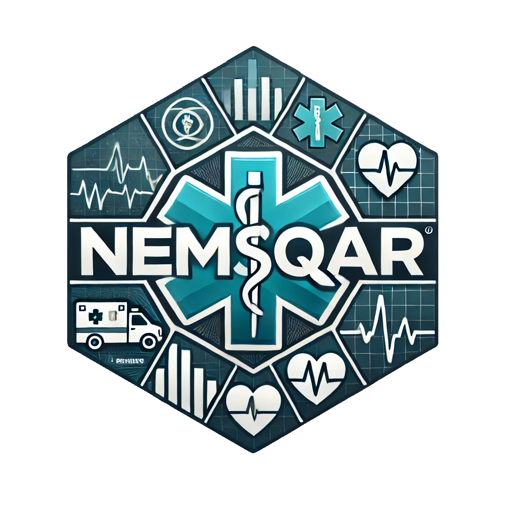

<!-- README.md is generated from README.Rmd. Please edit that file -->

# nemsqar 

<!-- badges: start -->

[](https://lifecycle.r-lib.org/articles/stages.html#stable)
[](https://github.com/bemts-hhs/nemsqar/actions/workflows/R-CMD-check.yaml)
[](https://CRAN.R-project.org/package=nemsqar)
[](https://app.codecov.io/gh/bemts-hhs/nemsqar?branch=main)
<!-- badges: end -->

`nemsqar` is an R package designed to automate the calculation of EMS
quality metrics as defined by the National EMS Quality Alliance
(NEMSQA). With a focus on enhancing EMS service performance through
reliable, evidence-based quality measures, `nemsqar` aims to streamline
metric calculation for healthcare providers, EMS agencies, and
researchers dedicated to improving patient outcomes.

## Installation

You can install the development version of `nemsqar` with:

``` r
# install.packages("remotes")
remotes::install_github("bemts-hhs/nemsqar")
```

Additionally, you may install the current version of `nemsqar` on CRAN
via:

``` r
install.packages("nemsqar")
```

## Functionality

`nemsqar` has functions that will always automate the calculation of a
service’s performance (or even a system’s) against the currently
approved list of NEMSQA Measures (see below). Given the large number of
these functions, please check the full package documentation resource
[here](https://bemts-hhs.github.io/nemsqar/).

## About NEMSQA

The National EMS Quality Alliance (NEMSQA) is committed to developing
and endorsing quality measures that improve patient and provider
experiences within EMS and healthcare systems. Originating from the EMS
Compass Project (2014), NEMSQA has evolved as an independent
organization, tasked with completing and sustaining the development of
impactful, evidence-based EMS quality measures.

### History of EMS Quality Measure Development

The structured development of EMS quality measures began with the EMS
Compass Project, an initiative funded by the National Highway Traffic
Safety Administration (NHTSA) and led by the National Association of
State EMS Officials (NASEMSO) to establish relevant performance measures
for EMS agencies. Since then, the field has advanced under the guidance
of NEMSQA, which works to create sustainable, practical, and high-impact
EMS quality measures through a collaborative, scientifically driven
process.

For more about NEMSQA, please visit their official website:
[nemsqa.org](https://www.nemsqa.org/).

------------------------------------------------------------------------

## NEMSQA Measure Set

The National EMS Quality Alliance (NEMSQA) Measure Set includes a
comprehensive list of EMS quality measures that have been developed and
approved for national use. These measures are intended to guide EMS
agencies in collecting data to assess and improve patient care. Below
are the measures approved by the NEMSQA Measure Development Committee
and Board of Trustees as of August 2019. Access to the full technical
specifications for these measures is available on the NEMSQA website
after creating a user profile.

### Key for **`Developed in Package?`** Column

- Developed and in package: ✔️
- Slated for future development: 🔧

| **Measure ID** | **Description** | **Type** | **National Quality Strategy Domain** | **Developed in Package?** |
|----|----|----|----|----|
| Airway-01 | Percentage of EMS responses from a 911 request with successful advanced airway placement on first attempt without hypotension or hypoxia in peri-intubation period. | Outcome | Clinical Process – Effectiveness | :heavy_check_mark: |
| Airway-05 | Percentage of intubation procedures from a 911 request in which adequate patient oxygen levels were achieved prior to intubation. | Process | Patient Safety | :heavy_check_mark: |
| Airway-18 | Percentage of successful advanced airway procedures from a 911 request in which waveform capnography is used for confirmation and monitoring. | Process | Clinical Process – Effectiveness | ✔️ |
| Asthma-01 | Percentage of EMS responses from a 911 request for asthma patients receiving an aerosolized beta agonist. | Process | Clinical Process – Effectiveness | ✔️ |
| Hypoglycemia-01 | Percentage of EMS responses from a 911 request for symptomatic hypoglycemia patients who receive treatment to correct hypoglycemia. | Process | Clinical Process – Effectiveness | ✔️ |
| Respiratory-01 | Percentage of EMS responses from a 911 request for respiratory distress patients with a respiratory assessment. | Process | Clinical Process – Effectiveness | ✔️ |
| Respiratory-02 | Percentage of EMS responses from a 911 request for patients with hypoxia receiving oxygen. | Process | Clinical Process – Effectiveness | ✔️ |
| Pediatrics-03b | Percentage of EMS responses from a 911 request for patients \<18 years receiving a weight-based medication with documented weight in kg or length-based estimate. | Process | Patient Safety | ✔️ |
| Safety-01 | Percentage of EMS responses from a 911 request without lights and sirens. | Process | Patient Safety | ✔️ |
| Safety-02 | Percentage of EMS transports from a 911 request without lights and sirens during patient transport. | Process | Patient Safety | ✔️ |
| Safety-04 | Percentage of EMS transports from a 911 or interfacility request for patients \<8 years transported with a pediatric restraint device. | Process | Patient Safety | ✔️ |
| Seizure-02 | Percentage of EMS responses from a 911 request for patients with status epilepticus who received benzodiazepine. | Process | Clinical Process – Effectiveness | ✔️ |
| Stroke-01 | Percentage of EMS responses from a 911 request for suspected stroke patients who had a stroke assessment. | Process | Clinical Process – Effectiveness | :heavy_check_mark: |
| Syncope-01 | Percentage of EMS responses from a 911 request for syncope patients with a 12-lead (or greater) ECG performed. | Process | Clinical Process – Effectiveness | ✔️ |
| TBI-01 | Percentage of EMS transports from a 911 request for suspected TBI patients with documented oxygen level, ETCO2, and systolic BP. | Process | Clinical Process – Effectiveness | ✔️ |
| Trauma-01 | Percentage of EMS responses from a 911 request for injury patients assessed for pain. | Process | Patient Experience | :heavy_check_mark: |
| Trauma-03 | Percentage of EMS transports from a 911 request for patients whose pain score decreased during EMS encounter. | Outcome | Patient Experience | :heavy_check_mark: |
| Trauma-04 | Percentage of EMS responses from a 911 request for patients meeting CDC trauma criteria transported to a trauma center. | Process | Clinical Process – Effectiveness | ✔️ |
| Trauma-08 | Percentage of EMS transports from a 911 request for trauma patients with documented GCS, systolic BP, and respiratory rate. | Process | Clinical Process – Effectiveness | ✔️ |
| Trauma-14 | Percentage of EMS transports from a 911 request for patients meeting Step 1 or Step 2 field triage criteria with a pre-arrival trauma alert. | Process | Clinical Process – Effectiveness | :heavy_check_mark: |
| TTR-01 | Percentage of EMS responses from a 911 request for non-transported patients with documented vital signs. | Process | Clinical Process – Effectiveness | ✔️ |

------------------------------------------------------------------------

# Resources

Interested persons may reference the following links and resources via
NEMSQA’s website. Note - some materials may require a free membership to
access.

- [Measure Specification Table
  (NEMSQA)\_2021](https://www.nemsqa.org/assets/docs/Measure-Specification-Table-NEMSQA_2021.pdf):
  A quick-reference table that includes broad-view measure
  specifications (i.e., numerator and denominator criteria) for each
  measure.
- [Project Summary with Measure
  Narratives](https://www.nemsqa.org/assets/docs/Project-Summary-with-Measure-Narrative-NEMSQA.pdf):
  An overview of the EMS Compass 2.0 project and narratives for each
  measure, which include systems implications.
- [Frequently Asked
  Questions](https://www.nemsqa.org/nemsqa-measure-faq): Answers to
  commonly asked questions.
- [NEMSQA Measure Technical Release
  Notes_2021](https://www.nemsqa.org/assets/docs/NEMSQA-Measure-Technical-Release-Notes_2021.pdf):
  A reference table that documents changes made to the NEMSQA measures
  during the 2021 annual review.
- [Fact
  Sheet](https://www.nemsqa.org/assets/docs/Fact-Sheet-NEMSQA.pdf): An
  info page explaining why agencies and systems should migrate from EMS
  Compass legacy/candidate measures to the National EMS Quality Alliance
  Measure Set.

# Thanks!

A big loud thanks to Sheree Murphy from NEMSQA, Peter Geissert from
Oregon EMS & Trauma Systems, Jeffrey Jarvis medical director for the
Metropolitan Area EMS Authority (Fort Worth, Texas), and Marshall
Washick (Washington D.C. Fire) for all their input and consultation!
